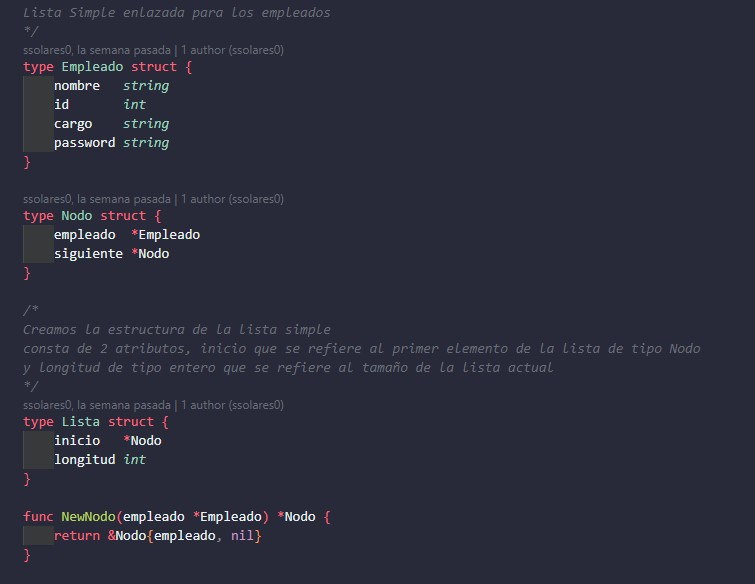
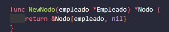
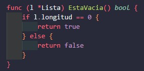
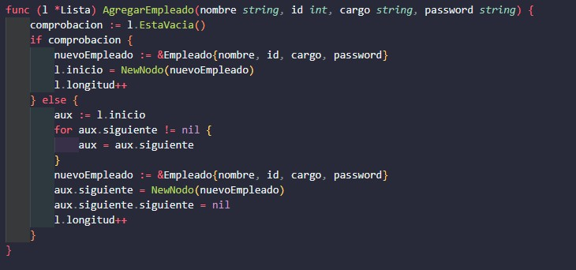
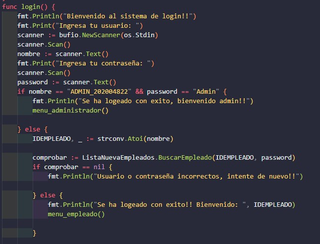
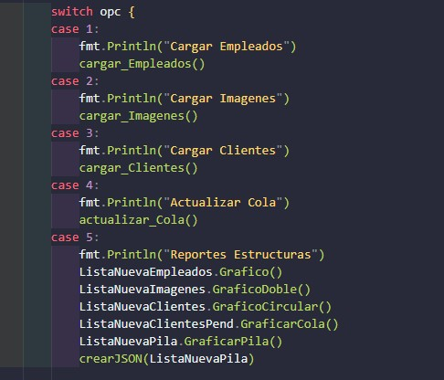
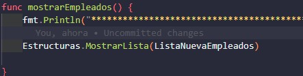
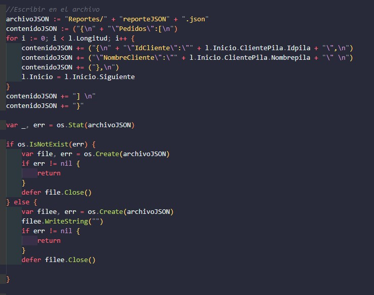

# Manual Tecnico

Hecho por Sebastian Solares, 202004822

## Lenguaje utilizado
Go es un lenguaje de programación moderno, simple, eficiente y escalable, diseñado para abordar las necesidades del desarrollo de software a gran escala. Su enfoque en la legibilidad, el rendimiento y la concurrencia lo convierte en una opción atractiva para una amplia gama de aplicaciones, desde pequeños scripts hasta sistemas distribuidos de alto rendimiento.

## Estructuras

Para la realizacion de este proyecto se utilizaron 7 estructuras: pila,cola,lista simple, lista doble etc.
Estas fueron creadas en una carpeta llamada Estructuras, ejemplo de lista simple:

Si Podemos observar se crea la estructura de la lista simple, que consta de 2 atributos, inicio que indica el primer elemento de la lista, y longitud que indica el tamano de la lista

#### Nuevo nodo y Esta vacia
Esta funcion sirve para empezar a llenar la lista simple, Esta vacia sirve para verificar si la lista no tiene ningun elemento

luego de verificar que no este vacia podemos llenar la matriz, se creo una funcion llamada agregar empleado que nos ayudara a ir cargando los datos a la lista simple

asi sucesivamente fue realizada cada estructura, con sus funciones independientes.

## MAIN
El main es la cabeza de todo, en este apartado se crearon los menus de login y empleado, se cargan los csv, se muestran los resultados, se genera la imagen etc.

### Menu login

### Menu administrador

### Cargar archivos CSV
Para las cargas masivas de estos archivos dare un ejemplo de cargar empleados:

Primero se obtiene la ruta, luego abrimos ese archivo, leemos todo lo que contiene el archivo, realizamos un for para luego ir buscando los datos deseados para mandarlos a la lista de empleados.

### Mostrar Datos
para esta parte se manda a llamar la funcion mostrar datos que esta en dicha estructura

### Crear JSON 

