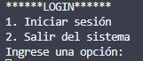
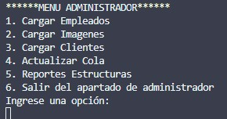
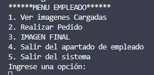
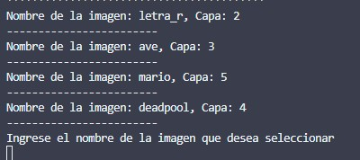
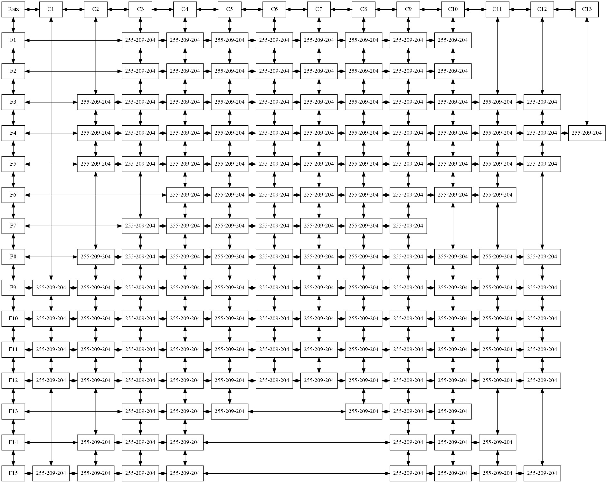
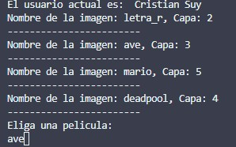
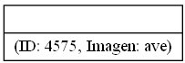
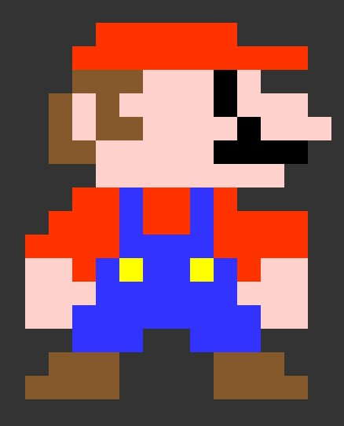

# Manual de usuario
hecho por: Sebastian Solares, 202004822

La empresa EDD Creative busca desarrollar una aplicación de escritorio que genere imágenes en píxeles. El objetivo es evitar el uso de formatos de imágenes convencionales como jpg, png o svg, los cuales ocupan mucho espacio en el almacenamiento en la nube. En cambio, se pretende generar imágenes utilizando intérpretes de HTML y CSS, ya que al ser generadas como código, ocupan menos espacio.

## MENU Login
En este apartado el administrador podra iniciar sesion para realizar futuras acciones, el administrador tiene su ID Y Password unica: ADMIN_202004822, Admin

## Menu Administrador
Una vez logeado como admin, podemos realizar varias tareas como: cargar clientes, empleados,imagenes,clientes en cola, como tambien podemos ver los reportes de las estructuras.

Si ya se cargaron los empleados podemos salir del apartado administrador e iniciar sesion con los empleados cargados.

En el menu de empleado podemos ver las imagenes cargadas, realizar pedido, ver la imagen final y salir del apartado empleado.

### Ver imagenes cargadas
cuando seleccionamos esta opcion nos mostrara las imagenes cargadas anteriormente en el menu ADMINISTRADOR y podemos seleccionar una imagen para visualizarla.

Una vez seleccionada la imagen y la capa. En la carpeta resultados aparecera la capa que previamente se selecciono.

### Realizar pedido
En este apartado nos mostrara todos los clientes en cola para ir despachando uno a uno para luego almacenarlos en pila

### IMAGEN FINAL
Al cargar todas las capas de la imagen podemos generar la imagen final, el cual nos generara el HTML y el css de dicha imagen

### Salir del sistema

Al seleccionar salir del sistema automaticamente se cierra el programa.
