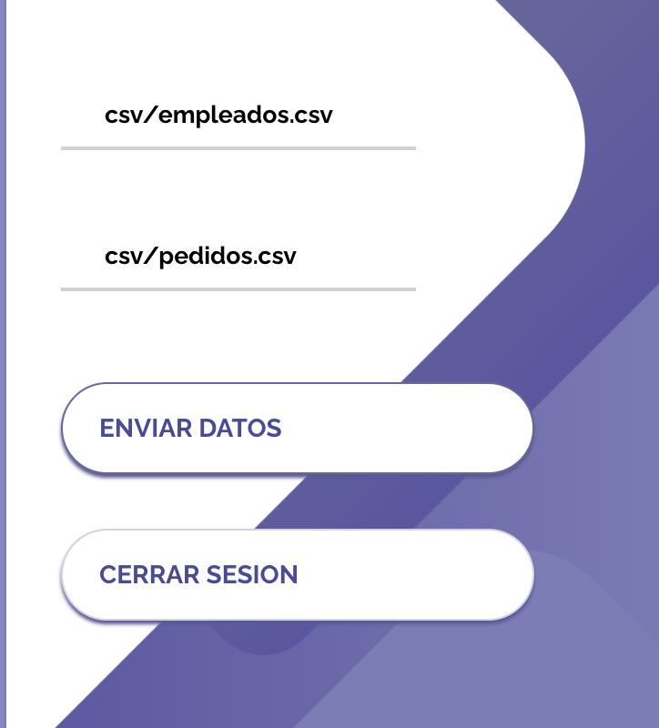
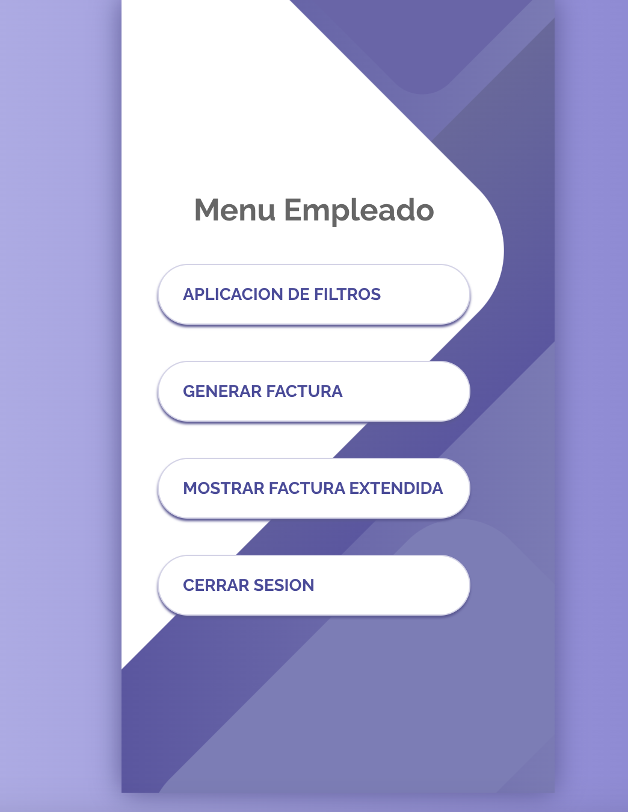
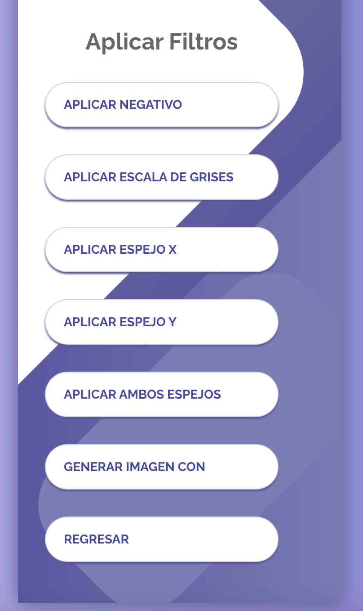
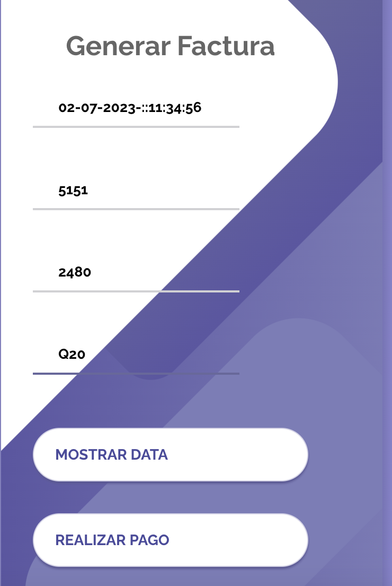

# Manual de Usuario
hecho por: Sebastian Solares, 202004822

La empresa EDD Creative ha solicitado el desarrollo de una aplicación web y un servidor para migrar su exitosa aplicación de consola a un entorno web. El objetivo es proporcionar a los usuarios y empleados un ambiente más agradable y funcional. Como desarrollador, se me ha encomendado la tarea de presentar un prototipo local de la aplicación que incluya un sistema de pagos para los clientes y un sistema de filtros para las imágenes.

## MENU Login
En este apartado el administrador podra iniciar sesion para realizar futuras acciones, el administrador tiene su ID Y Password unica: ADMIN_202004822, Admin

## Menu Administrador
Una vez logeado como admin, podemos realizar varias tareas como: cargar clientes, empleados, como tambien podemos ver los reportes de las estructuras.

Si ya se cargaron los empleados podemos salir del apartado administrador e iniciar sesion con los empleados cargados.

En el menu de empleado podemos Aplicar Filtros a los pedidos, generar factura, mostrar las facturas y cerrar sesion.

### Aplicacion de filtros
En la aplicacion de filtros podemos aplicar los diferentes filtros que la aplicacion nos ofrece, a una imagen se le podra aplicar escala de grises, negativos etc.

Podemos aplicarle varios filtros a cada imagen, para luego visualizarlo.

### Generar Factura
El sistema nos proporciona crear factura de los filtros aplicados, nos muestra el ID del cliente, empleado, fecha y cuanto se va cobrar.

